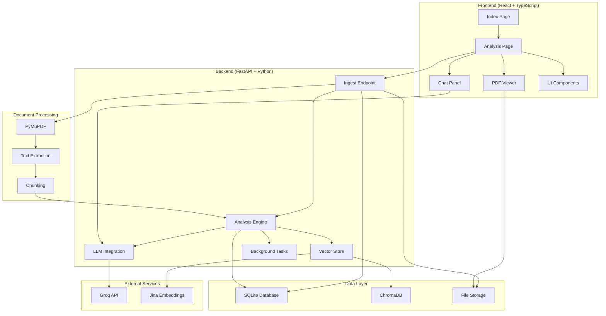
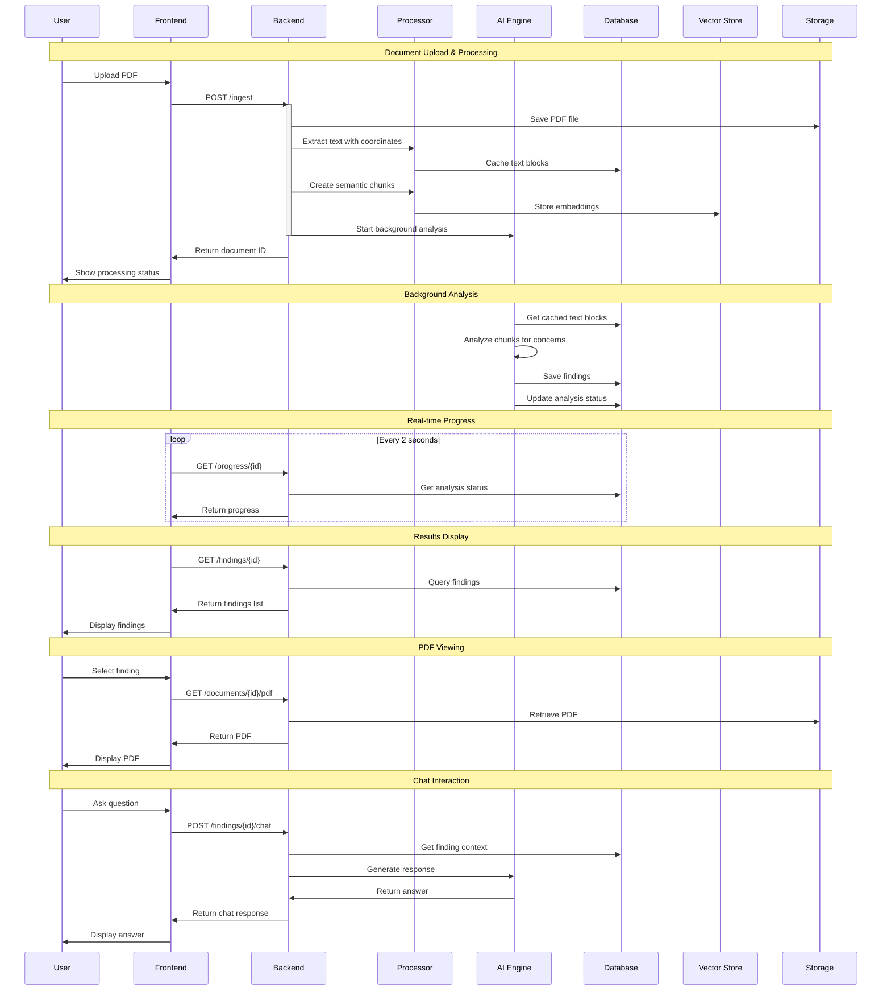
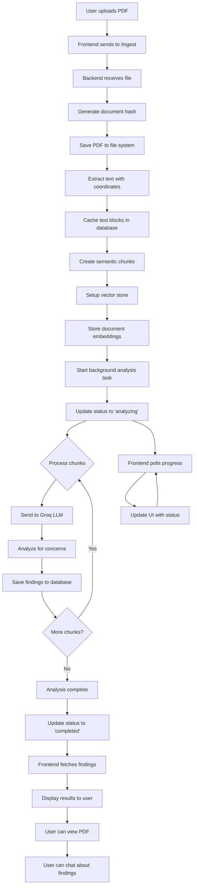
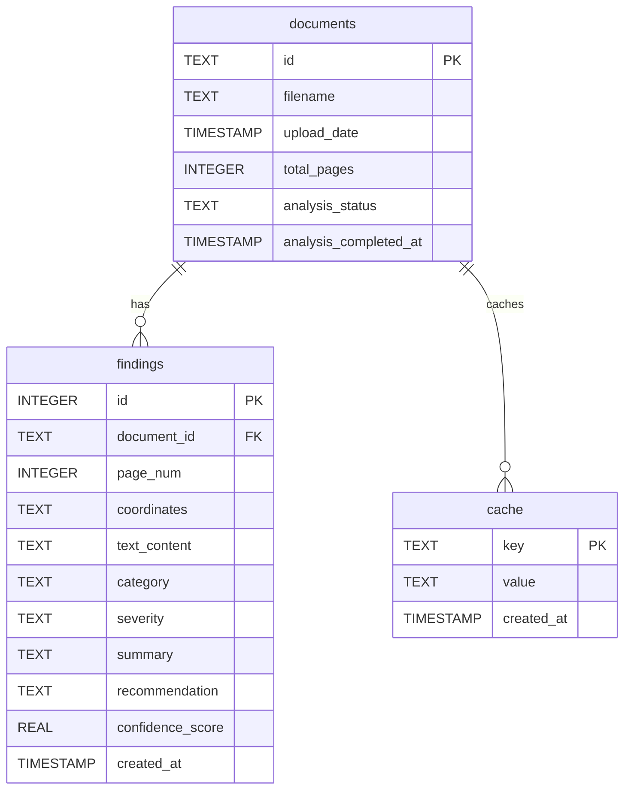
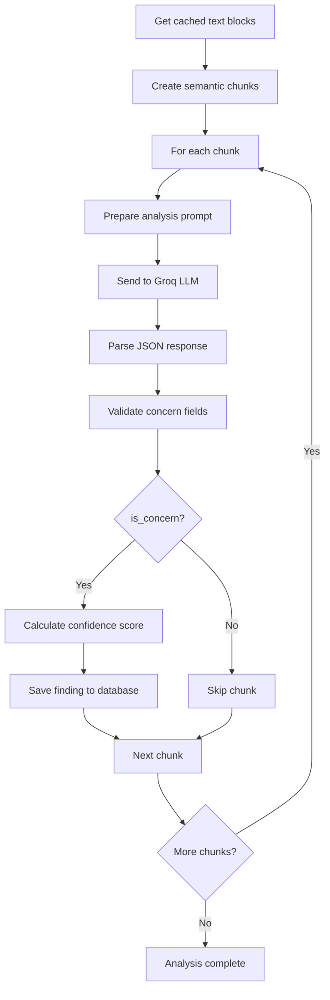
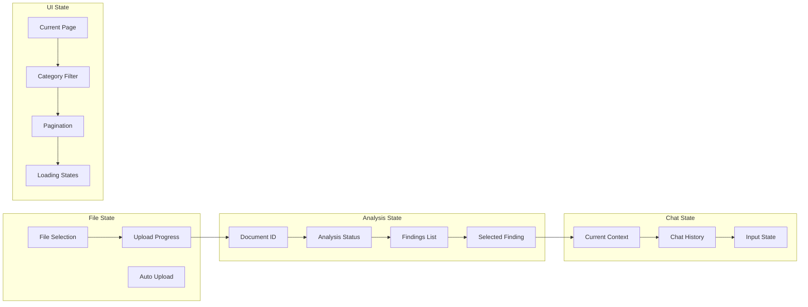
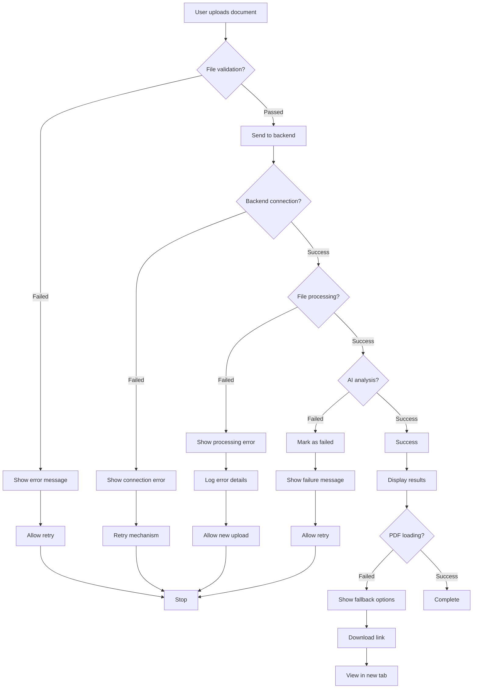
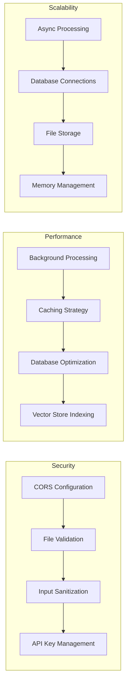
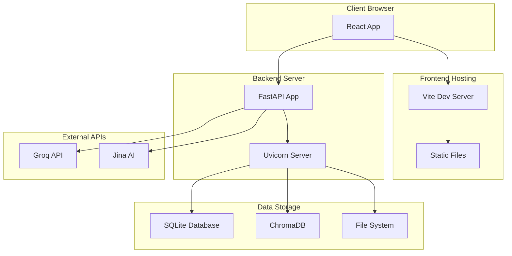

# Insurance Document Analysis System - Mermaid Architecture Diagrams

## 1. High-Level System Architecture



## 2. Data Flow Sequence Diagram



## 3. Processing Pipeline Flowchart



## 4. Database Schema



## 5. AI Analysis Flow



## 6. Frontend State Management



## 7. Error Handling Flow



## 8. Component Architecture

```mermaid
graph TB
    subgraph "Frontend Layer"
        subgraph "Pages"
            A1[Index.tsx]
            A2[Analysis.tsx]
            A3[NotFound.tsx]
        end
        
        subgraph "Components"
            B1[PDFViewer.tsx]
            B2[ChatPanel.tsx]
            B3[UI Components]
        end
        
        subgraph "State Management"
            C1[React Query]
            C2[useState/useEffect]
            C3[File State]
        end
        
        subgraph "API Layer"
            D1[api.ts]
            D2[Axios]
        end
    end
    
    subgraph "Backend Layer"
        subgraph "API Endpoints"
            E1[POST /ingest]
            E2[GET /analysis/{id}]
            E3[GET /findings/{id}]
            E4[POST /findings/{id}/chat]
            E5[GET /progress/{id}]
            E6[GET /documents/{id}/pdf]
            E7[GET /health]
        end
        
        subgraph "Core Services"
            F1[Document Processing]
            F2[Text Extraction]
            F3[Chunking Engine]
            F4[Analysis Engine]
            F5[Vector Store]
        end
        
        subgraph "AI Services"
            G1[Groq LLM]
            G2[Jina Embeddings]
            G3[Concern Detection]
        end
        
        subgraph "Background Tasks"
            H1[Analysis Task]
            H2[Progress Tracking]
        end
    end
    
    subgraph "Data Layer"
        subgraph "Databases"
            I1[SQLite]
            I2[ChromaDB]
        end
        
        subgraph "Storage"
            J1[File System]
            J2[Cache]
        end
    end
    
    subgraph "External Services"
        K1[Groq API]
        K2[Jina AI]
    end
    
    A1 --> A2
    A2 --> B1
    A2 --> B2
    A2 --> B3
    A2 --> C1
    C1 --> D1
    D1 --> D2
    
    E1 --> F1
    F1 --> F2
    F2 --> F3
    F3 --> F4
    F4 --> G3
    F4 --> F5
    
    G3 --> G1
    F5 --> G2
    G1 --> K1
    G2 --> K2
    
    H1 --> F4
    H2 --> H1
    
    E1 --> I1
    E1 --> J1
    F4 --> I1
    F5 --> I2
    F1 --> J2
    
    D2 --> E1
    D2 --> E2
    D2 --> E3
    D2 --> E4
    D2 --> E5
    D2 --> E6
```

## 9. Security & Performance



## 10. Deployment Architecture



## Key Technical Features Summary

### Frontend Stack
- **React 18** with TypeScript
- **Vite** for development
- **React Query** for state management
- **Tailwind CSS** for styling
- **Shadcn/ui** components
- **React Router** for navigation

### Backend Stack
- **FastAPI** for API
- **PyMuPDF** for PDF processing
- **Groq API** for LLM (llama-3.3-70b-versatile)
- **Jina Embeddings** for semantic search
- **ChromaDB** for vector storage
- **SQLite** for metadata
- **Background tasks** for async processing

### AI/ML Features
- **Semantic chunking** with location preservation
- **Concern detection** across 10 categories
- **Confidence scoring** for findings
- **Contextual chat** about specific findings
- **Deduplication** of similar findings

### Data Flow
1. **Upload** → PDF saved, text extracted with coordinates
2. **Processing** → Chunks created, embeddings generated
3. **Analysis** → AI analyzes each chunk for concerns
4. **Storage** → Findings saved with metadata
5. **Display** → Results shown with interactive features
6. **Chat** → Contextual Q&A about findings 